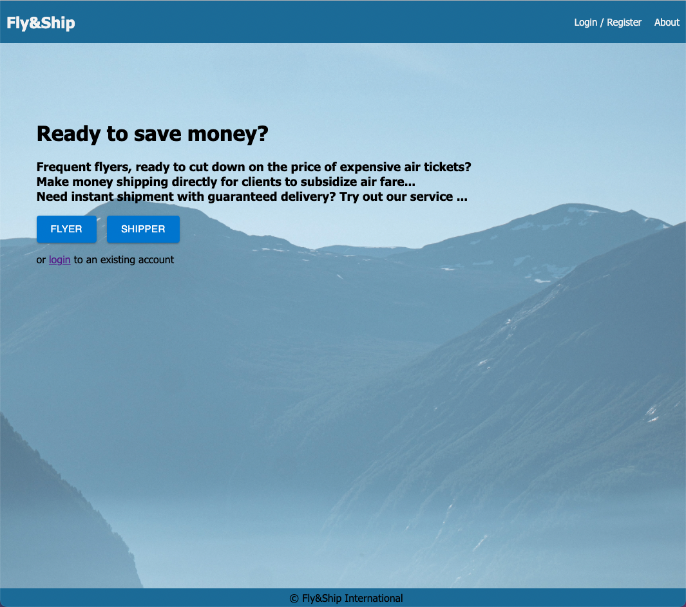
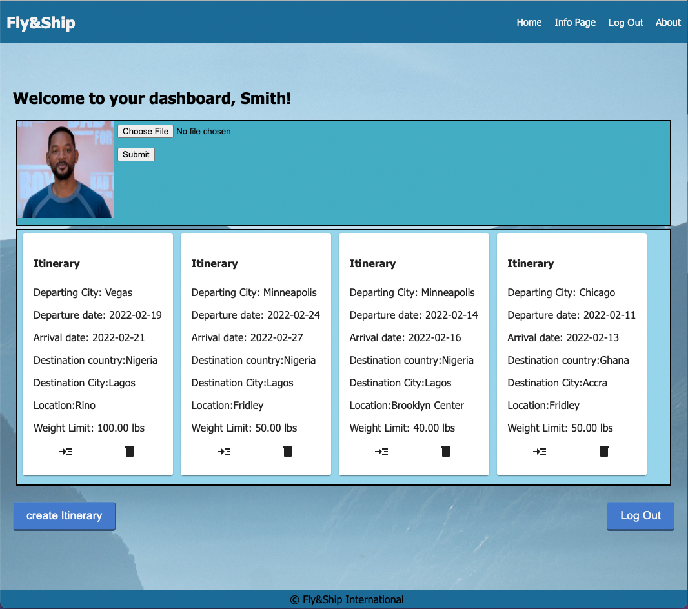
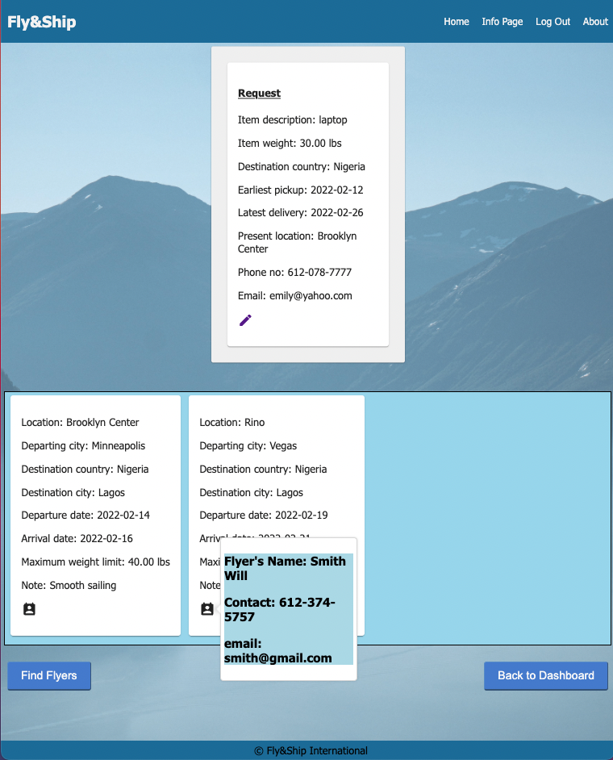
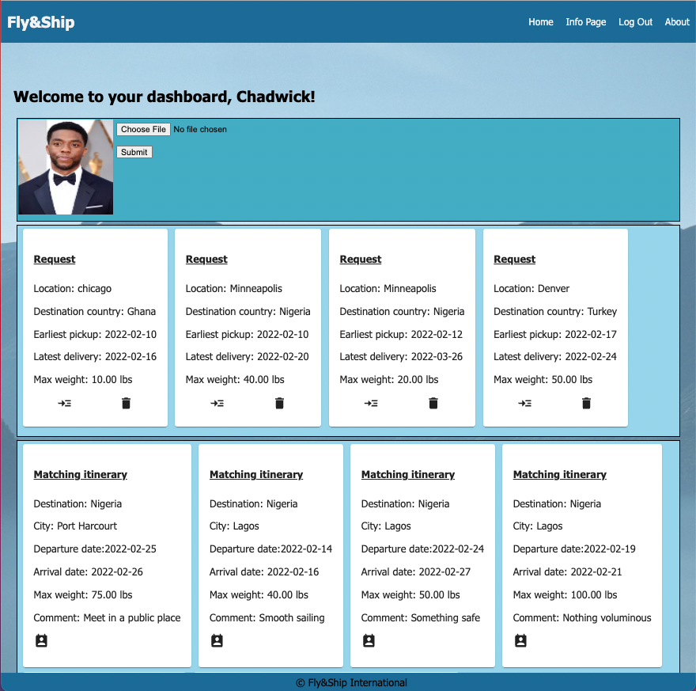
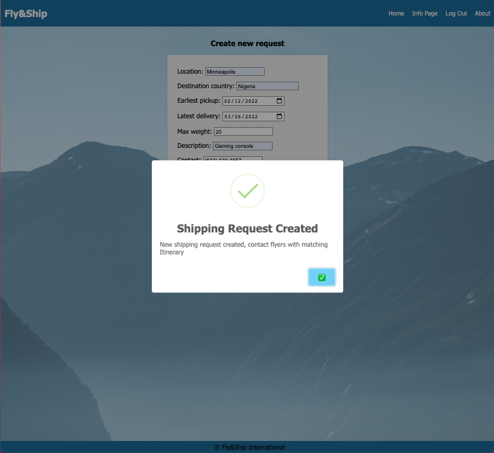

    
# Fly&Ship

## Table of Contents

- [Description](#description)
- [Built With](#built-with)
- [Screenshots](#screenshots)
- [Getting Started](#getting-started)
  - [Prerequisites](#prerequisites)
  - [Installation](#installation)
- [Usage](#usage)
- [Acknowledgements](#acknowledgements)
- [Contacts](#contacts)

## Description

This project is about a peer to peer web application to connect frequent flyers to people interested in shipping packages internationally.


## Built With

<a href="https://developer.mozilla.org/en-US/docs/Web/CSS"></a><a href="https://www.heroku.com/"></a><a href="https://developer.mozilla.org/en-US/docs/Web/HTML"></a><a href="https://developer.mozilla.org/en-US/docs/Web/JavaScript"></a><a href="https://jquery.com/"></a><a href="https://material-ui.com/"></a><a href="https://nodejs.org/en/"></a><a href="https://www.postgresql.org/"></a><a href="https://reactjs.org/"></a><a href="https://redux.js.org/"></a>

## Screenshots








## Getting Started

This version uses React, Redux, Express, Passport, and PostgreSQL (a full list of dependencies can be found in `package.json`).

To test the application. you need to create a database named solo-project.

then copy the contents of database.sql into the sql query


### Prerequisites

Before you get started, make sure you have the following software installed on your computer:

- [Node.js](https://nodejs.org/en/)
- [PostrgeSQL](https://www.postgresql.org/)
- [Nodemon](https://nodemon.io/)

### Installation

- Run `npm install`
- Create a `.env` file at the root of the project and paste this line into the file:
  ```
  SERVER_SESSION_SECRET=superDuperSecret
  ```
  While you're in your new `.env` file, take the time to replace `superDuperSecret` with some long random string like `25POUbVtx6RKVNWszd9ERB9Bb6` to keep your application secure. Here's a site that can help you: [https://passwordsgenerator.net/](https://passwordsgenerator.net/). If you don't do this step, create a secret with less than eight characters, or leave it as `superDuperSecret`, you will get a warning.
- Start postgres if not running already by using `brew services start postgresql`
- Run `npm run server`
- Run `npm run client`
- Navigate to `localhost:3000`

## Usage

To use the app, you have to register as a flyer or a shipper. As a flyer,  you are prompted to fill a form to create a new itinerary. A shipper on the other hand has to create a request form. Shipping requests are matched with itineraries and the user with the request is giving access to contact the user with the itinerary.

## Lay of the Land

There are a few videos linked below that show a walkthrough the client and sever setup to help acclimatize to the boilerplate. Please take some time to watch the videos in order to get a better understanding of what the boilerplate is like.

- [Initial Set](https://vimeo.com/453297271)
- [Server Walkthrough](https://vimeo.com/453297212)
- [Client Walkthrough](https://vimeo.com/453297124)

Directory Structure:

- `src/` contains the React application
- `public/` contains static assets for the client-side
- `build/` after you build the project, contains the transpiled code from `src/` and `public/` that will be viewed on the production site
- `server/` contains the Express App

This code is also heavily commented. We recommend reading through the comments, getting a lay of the land, and becoming comfortable with how the code works before you start making too many changes. If you're wondering where to start, consider reading through component file comments in the following order:

- src/components
  - App/App
  - Footer/Footer
  - Nav/Nav
  - AboutPage/AboutPage
  - InfoPage/InfoPage
  - UserPage/UserPage
  - LoginPage/LoginPage
  - RegisterPage/RegisterPage
  - LogOutButton/LogOutButton
  - ProtectedRoute/ProtectedRoute


## Acknowledgements

I acknowledge my Prime Woodall cohort, my instructor, my pod mates and everyone who contributed to the success of this project

## Contacts

<a href="https://www.linkedin.com/in/yemluck/"></a>  <a href="mailto:yemluck@gmail.com"></a>